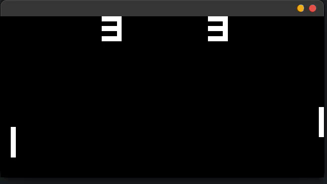
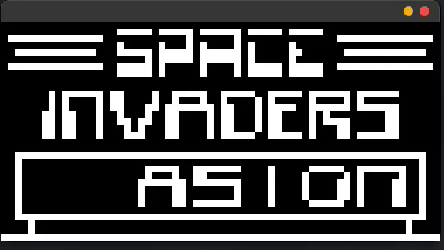

# CHIP-8 Emulator

Émulateur CHIP-8 écrit en C avec SDL2. Projet personnel pour comprendre le fonctionnement bas niveau d'un processeur : cycle fetch-decode-execute, décodage des opcodes, timers, affichage par sprites.





## Fonctionnalités

- Émulation complète du jeu d'instructions CHIP-8
- Écran monochrome 64x32 rendu avec SDL2
- Clavier hexadécimal 16 touches
- Timers delay et sound cadencés à 60 Hz
- Vitesse du CPU bridée (660 instructions par seconde par défaut)
- **6 quirks configurables à la volée**, avec un message dans la console à chaque activation/désactivation :
  - Shifting
  - Display wait
  - Jumping
  - Clipping
  - VF reset
  - Memory
- Pause avec la touche Espace

> Le son n'est pas implémenté : le sound timer est émulé mais aucun bip n'est joué.

## Prérequis

- Linux
- `gcc`
- SDL2

Installation des dépendances (Debian/Ubuntu) :

```bash
sudo apt install build-essential libsdl2-dev
```

## Compilation

```bash
gcc -Wall -Wextra -Werror -Wno-unused-parameter main.c -o main -I/usr/include/SDL2 -D_REENTRANT -lSDL2
```

## Utilisation

```bash
./main chemin/vers/rom.ch8
```

### Vitesse d'exécution

La vitesse est définie par la constante `INSTRUCTION_RATES` dans `main.c` (nombre d'instructions par seconde). Il est possible de la modifier si besoin.

## Contrôles

### Clavier CHIP-8

```
CHIP-8          Clavier PC
1 2 3 C         1 2 3 4
4 5 6 D         A Z E R
7 8 9 E         Q S D F
A 0 B F         W X C V
```

### Commandes de l'émulateur

| Touche | Action |
|--------|--------|
| `Échap` | Quitter |
| `Espace` | Pause / reprise |

### Quirks

| Touche | Quirk |
|--------|-------|
| `5` | Display wait |
| `6` | VF reset |
| `T` | Memory |
| `Y` | Clipping |
| `G` | Shifting |
| `H` | Jumping |

Les quirks correspondent aux différences de comportement entre les interpréteurs CHIP-8 historiques (COSMAC VIP, SUPER-CHIP...). Certaines ROMs n'ont besoin que d'un réglage précis pour tourner correctement, d'où la possibilité de les basculer pendant l'exécution.

**Par défaut, tous les quirks sont configurés en mode CHIP-8 d'origine** (comportement du COSMAC VIP). Si une ROM se comporte bizarrement, il faut basculer les quirks un par un avec les touches ci-dessus : le message affiché dans la console indique l'état de chacun.

## ROMs

Ce dépôt ne contient que des ROMs de test libres :

- `tests-Roms/` : ROMs pour tester les fonctionnalité de l'émulateur, provenant de la suite [Timendus](https://github.com/Timendus/chip8-test-suite)

Les ROMs de jeux commerciaux ne sont pas incluses.

## Tests

Toutes les tests provenant des ROMs de la suite Timendus passent.

## Ce que j'ai appris

- Le fonctionnement d'un CPU : le cycle fetch-decode-execute
- Le décodage des opcodes, que je ne connaissais pas du tout avant ce projet
- Le bridage de la vitesse d'exécution (ici 660 instructions par seconde) pour que les ROMs tournent à une vitesse jouable

## Ressources utilisées

### Guide principal : 
  - [Guide to making a CHIP-8 emulator (Tobias V. Langhoff)](https//tobiasvl.github.io/blog/write-a-chip-8-emulator/)
    
### Ressources annexes
- [Cowgod's CHIP-8 Technical Reference](http://devernay.free.fr/hacks/chip8/C8TECH10.HTM)
- [r/Emudev](https://www.reddit.com/r/EmuDev) / Discord d'Emudev
-  StackOverflow pour certaines questions spécifiques

## Licence

Ce projet est distribué sous licence MIT. Voir le fichier [LICENSE](LICENSE).
